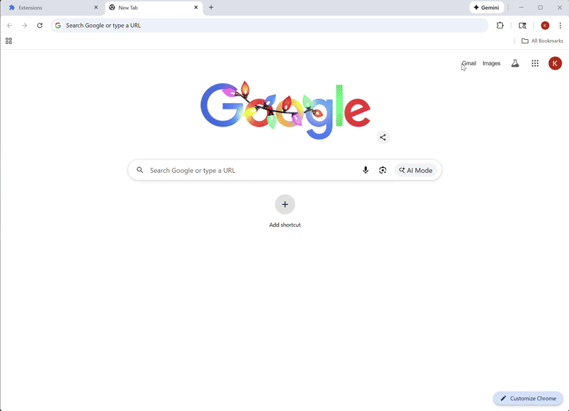

# BrainPlus

Your AI-powered knowledge assistant - A privacy-first browser extension that captures and organizes your browsing history using ML embeddings for semantic search, local RAG, and Ask Me Anything capabilities.

**🔐 Your data never leaves your device.** All browsing history, page content, and ML embeddings stay 100% local in your browser.

## 🎬 Demo



## 🏗️ Architecture

This is a monorepo containing:

- **`/extension`**: Chromium MV3 extension (Vite + React + TypeScript)
- **`/backend`**: FastAPI backend (Python + PostgreSQL + ClickHouse)

## 🎯 Key Features

- **🔒 100% Local & Private**: Your data never leaves your device - all processing happens in your browser
- **🤖 Ask Me Anything (AMA)**: Query your browsing history with natural language
- **🧠 Local RAG**: Retrieval-Augmented Generation with passage-level semantic search
- **🔍 Semantic Search**: Find pages by meaning, not just keywords
- **💾 Local-First Storage**: All browsing history stays on your device in IndexedDB
- **🎯 ML-Powered Embeddings**: 512-dimensional vectors using Universal Sentence Encoder (runs locally)
- **🛡️ Privacy-First**: Denylist protection for 75+ sensitive domains (banking, healthcare, email)
- **📝 Smart Chunking**: Sentence-aware passage generation for long documents
- **🗑️ Quality Eviction**: Intelligent storage management based on recency, intent, and access patterns

## 🚀 Quick Start

### Extension Development

```bash
cd extension
npm install
npm run dev        # Development with hot reload
npm run build      # Production build
```

### Backend Development

```bash
cd backend
docker-compose up -d  # Start PostgreSQL, ClickHouse, Redis
pip install -r requirements.txt
uvicorn app.main:app --reload
```

## 📚 Documentation

- **AMA_DESIGN_REVIEW.md**: Complete AMA feature design and gap analysis
- **AMA_IMPLEMENTATION_SUMMARY.md**: Phase 0 & Phase 1 implementation details
- **AMA_TESTING_GUIDE.md**: Comprehensive testing guide with 16 test cases
- **AMA_QUICK_REFERENCE.md**: Developer quick reference for AMA feature

## 🔒 Privacy & Security

**Your Data Never Leaves Your Device:**
- ✅ **100% Local Storage**: All browsing history, page content, and ML embeddings stay on your device in IndexedDB
- ✅ **Zero Data Collection**: We never see, store, or have access to your browsing data
- ✅ **No Cloud Sync**: Your personal knowledge base is yours alone
- ✅ **Offline-First**: Full functionality without internet connection (except optional deals feature)

**Additional Privacy Protections:**
- 🛡️ **Smart Denylist**: Automatically blocks scraping of 75+ sensitive domains (banking, healthcare, email, government)
- 🔐 **Encrypted Storage**: AES-GCM encryption for sensitive data
- 🎭 **Differential Privacy**: Optional aggregated signals (for deals) use Laplace noise and k-anonymity
- 🚫 **No PII**: Only anonymous IDs if you choose to use the optional deals feature

## 📦 Tech Stack

### Extension
- **Framework**: React 18 + TypeScript
- **Build**: Vite 5 with MV3 plugin
- **ML**: TensorFlow.js + Universal Sentence Encoder
- **Storage**: IndexedDB (local page digests) + chrome.storage.local (preferences)
- **Privacy**: All data stored locally, differential privacy for signals

### Backend (Optional)
- **API**: FastAPI with async/await
- **Database**: PostgreSQL (deals catalog, points, signals)
- **Deals**: Server-side attribution for affiliate tracking
- **Points**: Reward system for user engagement

## 🧪 Testing

### Extension
```bash
cd extension
npm test           # Unit tests
npm run test:e2e   # Brave compatibility tests
```

### Backend
```bash
cd backend
pytest             # Unit + integration tests
pytest --brave     # Brave-specific test suite
```

## 📋 Development Phases

- ✅ Phase 0: Privacy & Storage (Denylist, DB v4, Chunking, Quality Eviction)
- ✅ Phase 1: AMA MVP (Extractive answers, Citations, Passage retrieval)
- 🚧 Phase 2: LLM Integration (WebLLM, Streaming, Verifier)
- ⏳ Phase 3: Advanced Features (Global shortcut, Model download UI)
- ⏳ Phase 4: Testing & QA
- ⏳ Phase 5: Deployment

## 🎯 Critical Success Factors

- [x] Local-first architecture (IndexedDB)
- [x] Privacy-first denylist (75+ sensitive domains)
- [x] Semantic search with hybrid ranking
- [x] Passage-level chunking and retrieval
- [x] AMA with extractive answers and citations
- [x] Quality-aware storage eviction
- [ ] WebLLM integration (Phase 2)
- [ ] Streaming token generation (Phase 2)

## 📄 License

GNU Affero General Public License v3.0 (AGPL-3.0)

This project is licensed under the AGPL-3.0 License - see the [LICENSE](LICENSE) file for details.

**Key Points:**
- ✅ Free to use, modify, and distribute
- ✅ Must disclose source code of modifications
- ✅ Network use is considered distribution (SaaS clause)
- ✅ Derivatives must also use AGPL-3.0
- ✅ Protects user freedom and privacy

## 🤝 Contributing

Contributions welcome! This is an open-source project focused on privacy-first knowledge management.

